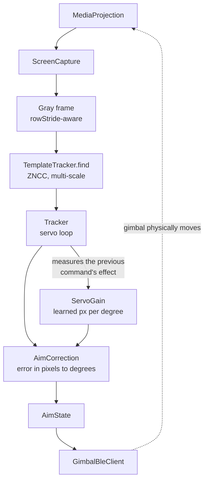

# OpenGimbal

An open-source Android replacement for the companion app that ships with cheap Bluetooth
selfie-stick gimbals (the Hohem / Honji "HJ360" OEM family — sold under names like
*Proove Axis*, *YESIDO SF18*, *SelfieShow*, *hoco K24* and a few dozen others).

The stock app (*Gimbal Show*) is the only way to use the hardware: without it the buttons and
the zoom slider do nothing. This project speaks the same Bluetooth protocol directly, so the
gimbal's buttons can be remapped to **any** action in **any** app — pinch-zoom in a camera app
that never heard of your gimbal, volume, media keys, navigation, or a full object-tracking
overlay.

> **Status:** working and in daily use, but the object-tracking overlay is still unverified on
> real hardware. See [Limitations](#limitations).

---

## Features

### Connection
- Scans for and connects to BLE gimbals, with model detection from the advertised name.
- Auto-connect to the last used device, optionally only while a camera app is in use.
- Manual pan/tilt/zoom control from the Control screen, replacing the physical knob.
- Live protocol log for diagnosing a device that doesn't behave.

### Mapping
Every trigger the gimbal reports can be bound to any compatible action, independently:

**Triggers** — the zoom slider, single / double / long trigger press, the shutter button on 1, 2
or 3 clicks, and single / double press of the M button.

**Actions** — volume up/down, play-pause, next/previous track, back, Home, Recents, swipe
up/down/left/right, press the camera app's on-screen shutter, and two continuous actions:
pinch-zoom and volume step.

The two continuous actions can only be driven by the one continuous trigger — the zoom slider —
so it is offered pinch-zoom and volume step. Everything else is one-shot.

Those continuous actions are the reason the app needs a service at all: a slider *position* has to
become a *sustained* pinch gesture, which cannot be done from a normal app.

### Camera app integration
- **On-screen shutter** — finds and presses the shutter button in whatever camera app is open,
  by reading the view hierarchy and falling back to a screenshot-and-locate for apps that draw
  their own UI.
- **Video recording detection** — asks the audio system whether the microphone is in use to tell
  a video recording from a photo, then can flip the gimbal and restart recording so the front
  camera is usable mid-take.
- **Flip watch** — detects the gimbal being flipped and re-levels.

### Tracking overlay
A floating button that appears **only while a camera app is in use**. Tapping it starts a screen
projection session and dims the screen with *"press on object to track"*. Tap an object and the
gimbal is steered to hold it in the centre of the frame. Double-pressing the trigger stops
tracking and returns the gimbal to level.

The matcher is a multi-scale zero-normalised cross-correlation (ZNCC) search — 1.0 means "the
same thing under any brightness or contrast", 0.0 means "unrelated" — which is what makes it
survive exposure changes as the gimbal pans. It requires a similarity floor *and* a margin over
the best rival candidate before it accepts a position, so it reports a loss rather than locking
onto a random patch of a smooth surface. See `tracking/TemplateTracker.kt`.

### Other
- 12 languages: English, German, French, Italian, Spanish, Portuguese, Polish, Russian,
  Ukrainian, Hungarian, Japanese, Simplified Chinese. Selectable in-app on Android 13+, via the
  system's per-app language screen too.

---

## Requirements

| | |
| --- | --- |
| Android | 10 (API 29) or newer |
| Target | API 36, compiled against API 37 |
| Hardware | Bluetooth LE. The gimbal must pair over BLE, not Wi-Fi |
| Toolchain | JDK 21, Android SDK with API 37 |

Some features are version-gated:

- **In-app language picker** — Android 13 (API 33), via `LocaleManager`. Below that the app
  follows the system language.
- **Screenshot-based shutter detection** — Android 11 (API 30), via the accessibility
  `takeScreenshot` API. Older versions still work if the camera app exposes its shutter in the
  view hierarchy.
- **MediaProjection consent** — a projection is single-use on Android 14+, so consent is asked
  each time tracking is started.

---

## Building

The project is a standard Gradle Android build.

```bash
# Point Gradle at your SDK
echo "sdk.dir=/path/to/Android/Sdk" > local.properties

# Unit tests
./gradlew :app:testDebugUnitTest

# Debug APK → app/build/outputs/apk/debug/app-debug.apk
./gradlew :app:assembleDebug
```

`local.properties` is machine-specific and deliberately not committed.

### Toolchain

| Component | Version |
| --- | --- |
| Gradle | 9.4.1 |
| Android Gradle Plugin | 9.2.1 |
| Kotlin | 2.2.10 |
| Compose BOM | 2025.12.00 |
| Java / Kotlin target | 11 |

### Tests

169 unit tests across 15 classes, all pure JVM — no emulator or device needed. They cover the
protocol codec, trigger decoding, the mapping store, shutter detection, and all three tracking
components (the template matcher, the correction maths, and the servo gain estimator).

```bash
./gradlew :app:testDebugUnitTest
```

Results land in `app/build/test-results/testDebugUnitTest/`.

### Releasing

Releases run from `.github/workflows/build.yml`, triggered by hand: **Actions → Build and
release → Run workflow**. Pushes and pull requests only test and build.

The version is an input, not something you edit in a file:

| Input | Meaning |
| --- | --- |
| `version` | Required. Without the `v` — `1.4.0` becomes the tag `v1.4.0`. |
| `version_code` | Optional. Left blank it is derived from the version: `1.4.0 → 10400`. |
| `prerelease` | Marks the GitHub release as a pre-release. |

Internally the workflow passes these as `-PversionName` / `-PversionCode`, which
`app/build.gradle.kts` reads. The same thing works locally:

```bash
./gradlew :app:assembleRelease -PversionName=1.4.0 -PversionCode=10400
```

**Signing is optional locally, required to publish.** Supply it through environment variables:

```bash
keytool -genkeypair -v -keystore release.keystore -alias opengimbal \
  -keyalg RSA -keysize 4096 -validity 10000

export RELEASE_KEYSTORE_FILE=$PWD/release.keystore
export RELEASE_KEYSTORE_PASSWORD=...
export RELEASE_KEY_ALIAS=opengimbal
export RELEASE_KEY_PASSWORD=...
./gradlew :app:assembleRelease
```

If the four variables are absent the build still succeeds and emits
`app-release-unsigned.apk`, so a plain `assembleRelease` works without a keystore. The release
job refuses to *publish* an unsigned APK, because it would be a file users cannot install.

To let CI publish, add four repository secrets — `RELEASE_KEYSTORE_BASE64` (the keystore,
base64-encoded), `RELEASE_KEYSTORE_PASSWORD`, `RELEASE_KEY_ALIAS`, `RELEASE_KEY_PASSWORD`:

```bash
base64 -w0 release.keystore   # paste the output as RELEASE_KEYSTORE_BASE64
```

Each release attaches `OpenGimbal-<version>.apk` and a matching `.sha256`. An existing tag is
never reused — the workflow fails instead, so a release can't silently land on a previous one.

> Note: a release APK is signed with a different key from the debug APK, so installing it over a
> debug build requires uninstalling first.

---

## Permissions, and what they're for

This app asks for machine-level access to your phone, so here is the honest accounting.

| Permission | Why |
| --- | --- |
| `BLUETOOTH_SCAN` / `BLUETOOTH_CONNECT` | Talk to the gimbal. `neverForLocation` is set — BLE is not used to infer location. |
| `ACCESS_FINE_LOCATION` | Only on API ≤ 30, where the platform requires it to discover BLE devices at all. |
| `POST_NOTIFICATIONS` | Connection status, and the mandatory notification for the tracking foreground service. |
| `MODIFY_AUDIO_SETTINGS` | **Read-only in practice.** Used to ask whether anything is holding the microphone, which is how a video recording is told from a photo. A normal permission, granted at install. No audio is ever recorded or listened to. |
| `FOREGROUND_SERVICE` (+ `_MEDIA_PROJECTION`) | Required by Android for screen capture. Unused unless tracking is switched on. |
| Accessibility service | See below. |

### About the accessibility service

Most of this app's power comes from one `AccessibilityService`, which is what lets a Bluetooth
button become a system-wide pinch, and what lets it press a shutter button in someone else's app.
It is also the single most dangerous permission on Android, so:

- It requests **`typeWindowStateChanged`** events only — it wants to know *which app is in front*,
  not what you are typing.
- It reads the screen **only** when a trigger mapped to the on-screen shutter fires, and only to
  locate that button — first the view hierarchy, then a screenshot if that finds nothing.
- It takes **no action** on any app other than pressing a shutter button, or performing a gesture
  you explicitly mapped to a gimbal button.
- It declares `accessibilityFlags="flagDefault"` and **not** `flagRequestTouchExplorationMode`,
  and it does not override `onMotionEvent`. It therefore cannot intercept, delay or suppress your
  touches — the service is examine-only with respect to your input.
- **Nothing is stored or transmitted.** No analytics, and no network permission is declared at all.

---

## Supported devices

Detection is by Bluetooth name prefix, ported from the official app's
`adapter_device_list.json` — with one fix: this implementation resolves the *longest* matching
prefix, whereas the official app takes the first match in list order and consequently mis-detects
e.g. `SelfieShow-Q18` as a Q09.

| Model | Example names |
| --- | --- |
| **M01** | `Proove Axis-M01`, `YESIDO SF18-M01`, `hoco K24-M01`, `HQ6-M01` |
| **M0X** | `TNW M0X`, `LENYES LPH113-M03`, `ZJ07 M0X`, `AX05-M0X` |
| **Q09** | `SelfieShow`, `EZ-I13`, `CiYatt-AI`, `Q09` |
| **Q18** | `SelfieShow-Q18`, `Gimbal Pro`, `EP-T202-Q18`, `L18` |
| **M07** | `M07` |
| **GIMBAL_AI** | `EC Gimbal AI`, `TNW AI`, `LINBER AI` |

The full prefix table lives in `gimbal/DeviceTable.kt`; adding a device is usually one line.
The **PK01** is Wi-Fi based and cannot be reached over the BLE UART profile, so it is listed only
to identify it clearly rather than to connect.

An unknown Bluetooth name is not rejected — the app still connects and tries the default protocol
variant, with the model reported as unknown.

---

## How it works

### Bluetooth protocol

All gimbals in this family expose the same BLE UART profile:

| | UUID |
| --- | --- |
| Service | `0000ffe0-0000-1000-8000-00805f9b34fb` |
| Write | `0000ffe1-0000-1000-8000-00805f9b34fb` |
| Notify | `0000ffe2-0000-1000-8000-00805f9b34fb` |
| CCCD | `00002902-0000-1000-8000-00805f9b34fb` |

Inbound state packets are `84 <len> <type> <payload…> <checksum>`; checksum is
`XOR(bytes[1 .. len-2]) + payload[0]`. Outbound commands use header `48`. Packets arriving
malformed are normal during connection setup and are dropped silently.

The protocol was reconstructed by disassembling the official app and inspecting its native
conversion library, then confirming the results against live traffic from a physical gimbal.
`gimbal/GimbalProtocol.kt` documents each frame it builds, naming the official method it derives
from in a comment. Two steering frame shapes exist — `onePtzStickFrame` for the M01/M0X,
`legacyStickFrame` for the rest.

No decompiled or proprietary material is included in this repository.

### Tracking loop

Tracking is deliberately structured so that the parts which are hard to test on a phone are pure
and testable in isolation:



Two things make this work that are easy to get wrong:

1. **One command at a time.** A correction is not sent until the previous one has had time to
   physically happen and the frame showing its effect has arrived. Otherwise each frame corrects
   the same unchanged error over and over, and the object orbits the centre instead of settling
   in it.
2. **The camera's field of view is measured, not assumed.** `ServoGain` learns pixels-per-degree
   from the observed result of each command, starting pessimistic so the first steps
   under-correct rather than overshoot.

### Non-obvious constraints

Kept here because they cost real debugging time and are the kind of thing a future change would
otherwise silently undo:

- `COARSE_STRIDE` in `TemplateTracker` **must stay 1.** At 2, the coarse pass samples every 8th
  pixel; the correlation peak at the true position can measure 1.00 while the best *sampled*
  point measures 0.20 in a window corner. The peak is never visited, so the fine pass searches the
  wrong place and the object is "lost" the instant it is selected.
- The ambiguity test compares a winner against its closest rival **only when the winner is strong
  enough to be worth defending** (`RIVALRY_FLOOR`). Run unconditionally, it rejects objects that
  are plainly visible, because on a coarse pass a rival will always look close.
- `find()` enforces its own similarity floor. Without it, a rejected answer at the right scale
  gets replaced by noise at the wrong scale that reports a deceptively "confident" score.
- The floating button's visibility is tracked by a flag separate from whether its window exists.
  Guarding the polling routine on the window state means the routine stops looking the first time
  it hides the button — and the button then never comes back.

---

## Project layout

```
app/src/main/java/com/itzdfplayer/opengimbal/
├── MainActivity.kt
├── accessibility/     # The service, shutter detection & pressing, gesture dispatch
├── camera/            # Is a camera/mic in use, is the gimbal flipped, orientation
├── gimbal/            # BLE client, protocol codec, device table, aim state, stick control
├── mapping/           # Trigger/action enums and their persistence
├── notifications/     # Connection status notification and its actions
├── tracking/          # Template matcher, servo loop, overlay windows, screen capture
└── ui/                # Compose UI: Device, Mappings, Control, Settings
```

Screens map to four top-level destinations: **Gimbal** (connect, enable the service, watch input),
**Mappings**, **Control** (steer from the screen), and **Settings** (preferences plus a live
status summary).

The platform-independent parts — the protocol codec, the mapping model, all three tracking
components — have no Android dependencies, which is why they are testable on the JVM.

### Tracking status readout

The Control screen shows the live similarity score, the measured offset, the correction being
applied, the learned pixels-per-degree, and a warning if measurements are coming back reversed.
That is the intended way to diagnose tracking behaviour on a real device, since none of it can be
reproduced faithfully in a unit test.

---

## Limitations

- **Tracking is unverified on real hardware.** The matcher, the correction maths and the servo
  estimator are all unit-tested, and the three bugs that made objects "instantly lost" were found
  and fixed with measurements rather than guesses — but whether the aim *sign* is correct for a
  given device, and whether every model honours pitch commands, has not been confirmed on a
  physical gimbal. The Control screen's readout exists to settle this.
- **`lintDebug` currently fails** on two pre-existing `MissingPermission` errors around
  `NotificationManagerCompat.notify` in `notifications/ConnectionNotifier.kt` and
  `gimbal/GimbalManager.kt`. Harmless at runtime; the permission is requested before those paths
  run.
- **Shutter detection is best-effort.** It depends on a camera app exposing its shutter button in
  the view hierarchy or on a screenshot the app can locate it in. Unusual camera UIs will not be
  found. False positives were a real hazard — the detector is tuned to prefer missing a shutter
  over pressing something else.
- **The status notification is not dismissible while connected**, deliberately: it is the only
  indication that a system-wide input service is active.
- **The screen-capture prompt reappears on every tracking start** on Android 14+, because a
  projection cannot be reused. This is a platform constraint, not a bug.

---

## Contributing

Two things would genuinely help:

1. **Test results on other gimbal models.** Especially whether the aim direction is right, and
   whether pitch is honoured on the Q09/Q18/GIMBAL_AI families.
2. **Bluetooth name prefixes** for devices not yet in `gimbal/DeviceTable.kt`. They are one line
   each.

User-visible strings belong in `res/values/strings.xml` and are translated into 11 locales. If you
add a string, add it to every `values-*/strings.xml` too. Entries marked `translatable="false"`
(app name, model codes) must **not** appear in locale files — a locale file defining one overrides
the base and freezes that value.

---

## License

MIT — see [LICENSE](LICENSE).

This project is not affiliated with Hohem, Honji, or any brand whose device it supports. Device
names are used only to identify compatible hardware. The Bluetooth protocol constants and the
device name table were reconstructed for interoperability with hardware the author owns.
